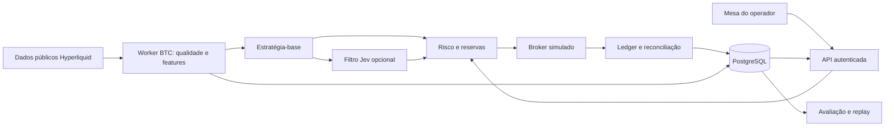

# PRD — Ganso Market 2.0

Versão 1.2 · 22/09/2026 · Proprietário: operador do Ganso Market.

**Emenda de escopo de 22/09:** por decisão do proprietário, backup e restauração de backup ficam fora deste ciclo até o sistema estar 100% operante. Não são requisito de coleta, operação, merge, implantação ou conclusão do Ganso 2.0. O antigo RF-17 e os prompts G2-02.2/3 foram retirados; eventual desenvolvimento será definido depois. Reinício de processo e reconciliação do ledger continuam no RF-10.

**Emenda de execução de 22/09:** o proprietário solicitou [RFCs e prompts pequenos](../prompts/ganso-2/README.md), uma fatia por sessão, com autorização de código → PR → merge → produção. O acompanhamento é uma linha por prompt, sem recibo ou arquivo de evidência formal obrigatório. Validações técnicas e registros funcionais do produto permanecem; esta emenda simplifica a entrega, não declara testes ou resultados que não ocorreram.

**Direção aprovada pelo proprietário; requisitos e critérios desta versão preparados para desenvolvimento.** A entrega deste documento não implementa funcionalidades nem altera produção. A aprovação da análise anterior define BTC, dados reais e US$ 1.000 fictícios como primeiro laboratório. Os valores operacionais adicionais abaixo são parâmetros iniciais de engenharia e pesquisa, não parâmetros comprovadamente rentáveis.

Documento vigente para o novo ciclo. Substitui o direcionamento exclusivo Polymarket do [PRD anterior](PRD.md), preservando seus registros históricos e os contratos financeiros ainda utilizados. Base conceitual: [decisão aprovada e pesquisa Jev](research/ganso-market-2-0-decisao-2026-09-22.md). Base operacional: [auditoria de infraestrutura](research/ganso-2-infraestrutura-2026-09-22.md) e [coleta somente de leitura](research/evidence/ganso-2-server-2026-09-22.json).

## 1. Decisão de produto

O Ganso 2.0 será uma mesa pessoal para executar operações simuladas com dados reais, explicar cada decisão e comparar estratégias depois dos custos. O primeiro instrumento será o **perpétuo padrão de BTC da Hyperliquid**, com saldo inicial fictício de US$ 1.000, margem isolada simulada, configuração de alavancagem de 1x e limite inicial de exposição de 25% do patrimônio por conta experimental.

O Ganso controla contas, reservas, ordens, risco, execução simulada e contabilidade. O Jev será um filtro opcional, versionado e comparável à estratégia sem IA. Não decide capital, alavancagem, limites nem procedimentos de emergência. O operador consegue comprar, vender, cancelar e encerrar posições simuladas pela interface e entender por que uma operação foi aceita ou recusada.

A Polymarket fica preservada como módulo especializado e acervo de pesquisa. Seus processos contínuos deixam de ser obrigatórios para o 2.0 após um encerramento controlado. Não haverá reescrita integral, importação completa de bots externos nem conclusão automática de todas as funcionalidades antigas: cada pendência receberá um destino verificável.

O custo atual informado é **US$ 80/mês, sem backup**. A transição começa no servidor existente; o objetivo após estabilização é operar com custo total recorrente de até US$ 80/mês, buscando uma faixa de planejamento de US$ 30–50/mês quando houver cotação e capacidade comprovadas. Essa faixa é uma meta de orçamento, não uma oferta de provedor.

## 2. Problema que precisamos resolver

Existe uma base relevante de coleta, simulação, contabilidade e interface, mas o projeto acumula diferentes gerações de código, documentos desatualizados, trabalhos locais não integrados e critérios de aceite ainda sem comprovação operacional. Adicionar outra estratégia sem resolver isso perpetuaria divergências de saldo, processos sem utilidade e crescimento de dados sem finalidade.

A medição de 22/09 mostra que a urgência é operacional: banco de 186,91 GiB, 30,96% do filesystem disponíveis e 789 reinícios acumulados do processo paper na vida do container observado. O host tem 8 CPUs e aproximadamente 15,24 GiB de RAM, com 13,39 GiB disponíveis naquela amostra. Uma fotografia não prova capacidade sustentada, mas não justifica comprar mais RAM.

O crescimento líquido de ocupação entre a amostra válida de 18/09 e a consulta de 22/09 foi aproximadamente 17,51 GiB/dia. Restavam 17,88 GiB até o piso de 25% disponível. **Se esse ritmo se repetir, esse piso seria atingido em aproximadamente um dia.** É uma extrapolação de capacidade, não uma previsão de falha. O primeiro bloco precisa conter o crescimento e investigar reinícios antes de adicionar coleta contínua.

## 3. Usuário, objetivos e sucesso

Usuário único: proprietário operando e avaliando estratégias próprias. Não haverá clientes, fundos de terceiros, tenants ou produto SaaS.

| Objetivo                     | Como reconhecer a entrega                                                                                                   |
| ---------------------------- | --------------------------------------------------------------------------------------------------------------------------- |
| Operar de ponta a ponta      | Ticket cria ordem simulada; reservas, fills parciais, cancelamento, fechamento e restart reconciliam com o mesmo ledger     |
| Entender decisões            | Toda entrada, recusa e saída tem motivo, estado observado, versão, custos e vínculo à ordem                                 |
| Produzir evidência econômica | Comparação prospectiva entre estratégia-base, variante Jev e referência BTC/caixa, com todos os custos e risco              |
| Encerrar a dívida herdada    | Todo componente e bloco anterior tem destino, justificativa, dependências e registro curto de encerramento ou transferência |
| Operar com custo previsível  | Crescimento limitado, serviços necessários identificados, teto de IA e custo total dentro do orçamento                      |
| Preservar evolução futura    | Adaptadores de mercado separados; mesma disciplina financeira para uma futura integração de execução real                   |

Não são métricas de sucesso: número de trades, porcentagem de acerto isolada, confiança do Jev, quantidade de código removido, retorno diário obrigatório ou lucro em uma única janela. Uma estratégia rejeitada com evidência útil é um resultado válido do produto.

## 4. Situação atual verificada

### 4.1 Fontes de verdade e divergências

| Superfície           | Referência observada em 22/09                                                        | Consequência                                                                      |
| -------------------- | ------------------------------------------------------------------------------------ | --------------------------------------------------------------------------------- |
| Checkout local       | `d04875aa2845081f8cd24f98fb10acc816fcb7c5`, com alterações locais de outras entregas | Não iniciar o núcleo 2.0 diretamente dessa base nem sobrescrever o trabalho local |
| `main` no GitHub     | `51621836ae5d90adeafeb915d4d664ce8d0b7900`, fecho FIN-07/PR 200                      | Base inicial de reconciliação; revalidar SHA ao iniciar implementação             |
| Release no host      | `f2f552801be2162515b0b4cf113a863c5726c672`                                           | A diferença para main documental não prova falha de deploy                        |
| API e resolução      | `f2f5528`                                                                            | Conferidas por arquivo de versão dentro dos containers                            |
| Paper e portfólio    | `6279457`                                                                            | Incluem FIN-07; o paper tem reinícios a investigar                                |
| Recorder / estimator | `8132cd3` / `da6d560`                                                                | Versões diferentes exigem matriz de compatibilidade, não rebuild indiscriminado   |

A leitura remota de `financial.ts`, `financialstore.ts` e `reservations.ts` confirma contabilidade por dono e reservas posteriores à base local. O [fecho FIN-07](https://github.com/henrique-devel/ganso-market/blob/51621836ae5d90adeafeb915d4d664ce8d0b7900/docs/roadmap/receipts/FIN-07.md) registra 319 testes aprovados e migration 0026. Esses são resultados históricos, não testes executados nesta elaboração. FIN-07 não deve ser tratado como ainda não implementado.

A [issue 198](https://github.com/henrique-devel/ganso-market/issues/198) permanece aberta para investigar a origem de transação ociosa; o defeito de inicialização da resolução foi corrigido no PR 199. A consulta atual encontrou zero sessões `idle in transaction`, o que não comprova ausência de recorrência. O recibo EXEC-05 existe localmente, mas não no caminho consultado da main; seu resultado antigo não substitui uma nova prova integrada sobre a base corrigida.

### 4.2 Destino dos componentes

| Componente atual                                             | Destino no 2.0                                                                 | Fecho exigido                                                                                            |
| ------------------------------------------------------------ | ------------------------------------------------------------------------------ | -------------------------------------------------------------------------------------------------------- |
| API Fastify, React/Vite, autenticação e PostgreSQL           | Manter                                                                         | Adaptar rotas e contratos sem perder autenticação, proteção de escrita e rastreabilidade                 |
| `paper/financial*`, ownership, reservas e replay             | Extrair a parte genérica e adaptar                                             | Paridade com fixtures financeiras aprovadas; contratos próprios para perpétuos                           |
| `fundamental/fixed.ts`, contratos monetários                 | Reaproveitar dinheiro/quantidade, separar probabilidade                        | Nenhuma limitação a preços entre 0 e 1 no domínio BTC; precisão e arredondamento explícitos              |
| Broker e bridge Polymarket                                   | Preservar no adaptador legado; reutilizar padrões                              | Retirar taxas, atrasos e regras binárias do núcleo compartilhado                                         |
| Kelly binário, EV `q−preço`, YES/NO e resolução              | Manter exclusivos da Polymarket                                                | Nenhum uso dessas fórmulas para dimensionar BTC perpétuo                                                 |
| Recorder, estimator, resolution e portfolio Polymarket       | Encerrar execução contínua quando houver preservação e tratamento das posições | Manifesto de desligamento e timers; leitura do histórico continua possível                               |
| `services/market-engine` Rust                                | Retirar do perfil padrão se confirmado apenas bootstrap/health                 | Remover dependências de readiness/Compose/CI correspondentes; não apenas esconder container              |
| `workers/model-worker` Python                                | Arquivar o esqueleto sem modelo                                                | Retirar imagem/checks obrigatórios sem consumidores; histórico Git e contratos úteis preservados         |
| Fast BTC/horário Polymarket, replay e modelos ainda parciais | Congelar implementação específica; transferir requisitos úteis                 | Mapa para blocos 2.0; não apresentar esqueleto como estratégia pronta                                    |
| Retenção, proteção de dados e HOLD                           | Reaproveitar seletores, quotas e proteções já integrados                       | Histórico necessário protegido no banco; descarte apenas do conjunto dispensável autorizado              |
| Mesa, Decisões e Sistema                                     | Evoluir                                                                        | Fluxos simples para operador, detalhes técnicos sob demanda, acervo legado separado                      |
| Timers de watchdog, replay e série de capacidade             | Revisar individualmente                                                        | Nenhum supervisor pode ressuscitar serviços aposentados; crescimento passa a ter acompanhamento contínuo |

O inventário definitivo é uma entrega do primeiro marco: a tabela acima é o destino de produto, não uma alegação de que todos os usos indiretos já foram eliminados.

## 5. Escopo da primeira versão utilizável

**Incluído:** uma venue; um BTC perpétuo; dados públicos reais; três contas experimentais independentes (manual, base e Jev), cada uma com referência fictícia de US$ 1.000; ordens limite com validade e ordens executáveis imediatamente com limite de preço; execução parcial; cancelamento; reduce-only; margem/funding/liquidação simulados; limites; reconciliação; estratégia-base; comparação; explicações; retenção e orçamento operacional.

As três contas são cenários alternativos, não uma banca única de US$ 3.000. O painel não soma seus patrimônios. A conta Jev começa desabilitada até concluir integração e orçamento; referências BTC/caixa são curvas normalizadas, sem reserva financeira compartilhada.

**Fora desta versão:** dinheiro real, signer, depósito, saque, chaves de negociação, multiativos, arbitragem entre venues, market making subsegundo, otimização automática contínua, LLM local/GPU, treinamento distribuído, Kubernetes, Kafka, bancos gerenciados, multi-region e reconstrução de todos os produtos antigos. O adaptador live futuro será outro marco, com decisão própria de capital e orçamento de perda.

## 6. Jornadas do operador

1. **Abrir a mesa:** ver “SIMULAÇÃO”, fonte real, horário/frescor dos dados, conta selecionada, saldo disponível, margem comprometida, patrimônio e estado operacional.
2. **Enviar uma operação:** escolher comprado/vendido, quantidade ou nocional, tipo, validade e proteção de preço; visualizar custo estimado, reserva, risco planejado e efeito sobre exposição; confirmar o ticket simulado.
3. **Acompanhar execução:** distinguir criada, aceita, parcialmente executada, cancelamento solicitado, cancelada, expirada, executada e recusada. Pedido de cancelamento não significa cancelamento efetivo.
4. **Encerrar ou pausar:** pausar novas entradas, cancelar ordens abertas ou solicitar fechamento são três ações diferentes. Fechamento respeita liquidez e limita preço; falha aparece como posição ainda aberta.
5. **Entender uma decisão:** abrir a ficha com candidato-base, filtros, influência efetiva do Jev, custos, fills, saída e resultado. Dado ausente, veto de risco e falta de sinal são estados distintos.
6. **Comparar versões:** observar retorno líquido, drawdown, tempo exposto, giro, custos e operações evitadas. Congelar uma versão e criar novo experimento; nunca apagar perdas para reiniciar a estatística.
7. **Acompanhar o sistema:** ver interrupções, reconciliação, disco e custo mensal projetado em linguagem simples.

A interface principal terá Mesa, Operações, Experimentos e Sistema. Polymarket fica em “Histórico / laboratório legado”, sem parecer uma segunda execução ativa por padrão. Explicações descrevem registros que causaram a decisão; não são justificativas inventadas depois do resultado.

## 7. Requisitos funcionais e aceites

| ID    | Requisito obrigatório             | Aceite verificável                                                                                                                                                         |
| ----- | --------------------------------- | -------------------------------------------------------------------------------------------------------------------------------------------------------------------------- |
| RF-01 | Separar dados, decisão e execução | Identidades explícitas `real/replay/synthetic`, `baseline/jev/heuristic` e `paper`; nenhum fallback se apresenta como Jev real; nenhuma chave habilita live implicitamente |
| RF-02 | Catálogo BTC da venue             | Instrumento/contrato/colateral, incrementos, mínimo, funding, taxas e manutenção de margem têm origem e versão; valor incompatível é recusado                              |
| RF-03 | Feed com tempo e integridade      | Timestamps de origem/recebimento, conexão, gaps, duplicatas e recuperação registrados; barras fechadas de 15 min/1 h sem preencher lacunas silenciosamente                 |
| RF-04 | Conta e ledger                    | Eventos imutáveis por conta/estratégia/experimento/instrumento; replay recupera saldos, posição, taxas e funding sem diferença monetária                                   |
| RF-05 | Reserva atômica                   | Duas ordens concorrentes não usam o mesmo saldo/margem; duplicação não duplica débito; cancelamento libera somente a parcela efetiva                                       |
| RF-06 | Ticket manual simulado            | Compra, venda, parcial, cancelamento e fechamento percorrem o mesmo controle financeiro da estratégia automática                                                           |
| RF-07 | Broker realista                   | Fill exige dados executáveis após latência; limita profundidade, rejeita post-only que cruzaria, respeita validade e custos; toque na cotação não basta para fill maker    |
| RF-08 | Perpétuos                         | Funding ocorre no horário correto e uma vez; margem, mark price e liquidação testados em long/short; 1x não é tratado como spot                                            |
| RF-09 | Risco independente                | Jev não altera caps; ordens manuais também os respeitam; dados inválidos e divergência contábil bloqueiam aumento de risco                                                 |
| RF-10 | Reinício e falha                  | Reiniciar no meio de fill/cancelamento/funding não duplica eventos; reconciliação precede reabertura de entradas                                                           |
| RF-11 | Estratégia-base                   | Implementação determinística, fechada e versionada; parâmetros e saídas publicados antes da observação futura                                                              |
| RF-12 | Challenger Jev                    | Mesmo candidato-base, filtragem delimitada; resposta registrada com deadline, versão e custo; erro/timeout causa abstenção de entrada                                      |
| RF-13 | Avaliação                         | Curvas independentes e comparáveis; resultado líquido, contribuição Jev, exposição e incerteza; todas as tentativas de configuração registradas                            |
| RF-14 | Auditoria acessível               | Toda ordem chega ao input, decisão, reserva, fills e saída; recusa contém motivo útil sem expor segredos                                                                   |
| RF-15 | Custos e retenção                 | Orçamento medido, limite de IA, crescimento e retenção por classe; pins financeiros não são removidos para cumprir quota                                                   |
| RF-16 | Encerramento do legado            | Manifesto cobre código, serviços, tabelas, timers, configurações, testes, telas, docs e branches; cada item tem destino e resultado resumido                               |

### 7.1 Contrato financeiro mínimo

Usar decimal/fixed-point com unidade e escala declaradas. USD/USDC de referência, BTC, preço USD por BTC, taxa e probabilidade são tipos diferentes. Registrar conversão adotada do colateral; no experimento inicial a hipótese de paridade é explícita e não elimina risco futuro de descolamento.

No perpétuo, o nocional comprado não sai do caixa como aquisição spot: há margem reservada, realização de PnL, taxas e funding. A projeção deve satisfazer `patrimônio = saldo de colateral + PnL não realizado`, com taxas e funding já refletidos uma vez no saldo. Margem/reservas são restrições ao disponível, não despesas; não subtraí-las duas vezes do patrimônio. Marcação executável é usada para valor de encerramento; mark/oracle da venue para manutenção e liquidação, com ambos visíveis e datados.

Cada evento registra conta, experimento, estratégia, instrumento, identificador de decisão/ordem/fill, momento econômico, momento de recebimento e versões de política, modelo de execução, contabilidade e taxa. Correções são novos eventos. Não reinterpretar eventos binários antigos como posições BTC nem injetar capital novo para esconder prejuízo.

### 7.2 Parâmetros iniciais de risco

| Parâmetro                   | Valor inicial                                                              | Regra                                                                                              |
| --------------------------- | -------------------------------------------------------------------------- | -------------------------------------------------------------------------------------------------- |
| Capital simulado            | US$ 1.000 por cenário independente                                         | Reset cria novo experimento; histórico anterior continua íntegro                                   |
| Configuração de margem      | Isolada, 1x                                                                | Simular manutenção, funding e liquidação da venue                                                  |
| Exposição bruta             | Até 25% do patrimônio positivo                                             | Aberturas e reservas pendentes entram no cálculo; US$ 250 apenas no início                         |
| Risco planejado por entrada | Até 0,25% do patrimônio                                                    | US$ 2,50 inicialmente, incluindo custo estimado de ida e volta; stop não garante essa perda máxima |
| Posições                    | Uma posição líquida BTC por conta                                          | Sem piramidagem na versão inicial; reduzir antes de inverter                                       |
| Pausa diária                | Queda de patrimônio de 1,5% desde âncora UTC, ajustada por fluxos externos | Inclui PnL não realizado, taxas e funding; não apenas PnL realizado                                |
| Pausa por drawdown          | 5% desde máxima do experimento                                             | Bloqueia entradas e cancela intenções de aumento; saídas continuam geridas                         |
| Jev                         | Tamanho e alavancagem imutáveis para o modelo                              | Resposta jamais substitui limite determinístico                                                    |

Estados: NORMAL, REDUCE_ONLY e HALTED. O significado das permissões de saída é explícito: falha de feed não inventa preço para fechar; contabilização inconsistente exige reconciliação. Retomada registra motivo, condições de dados/risco e ação do operador; não zera âncoras para liberar entradas.

### 7.3 Execução e dados ausentes

O MVP prioriza ordens executáveis imediatamente com limite de preço para obter um simulador verificável. Ordens passivas entram com modelo conservador e identificado; ausência de evidência de fila significa menor confiança no resultado, nunca preenchimento otimista. IOC executa apenas a parcela disponível; restante é cancelado. Reduce-only não pode aumentar nem inverter a posição mesmo com corrida entre ordens.

Metas iniciais: livro até 2 s para aceitar uma intenção executável; intenção expira em até 5 s e é revalidada antes do fill; mark até 5 s para o ciclo de risco; sinal usa somente barras fechadas. Esses limites devem ser confrontados com a captura real antes de ativar automação. Falta de negócio recente não significa necessariamente feed morto: saúde de conexão, confirmação da fonte e semântica de cada canal são verificadas separadamente.

Durante desconexão, marcar lacuna e suspender novos fills sem evidência. Replay de intervalo incompleto recebe qualidade degradada. Gaps atravessando stops ou liquidação geram cenário conservador/inconclusivo com limite de perda incerto, não ganho assumido. Reexecução histórica usa respostas Jev previamente capturadas, sem perguntar ao modelo atual sobre um passado conhecido.

## 8. Hipótese econômica e uso de Jev

### 8.1 Primeiro experimento

Hipótese: continuação de tendência em contexto de 1 h, com decisão em barras fechadas de 15 min e permanência máxima inicial de 6 h. O bloco da estratégia deve fechar uma única regra reproduzível de tendência, entrada, stop, saída e tamanho por volatilidade antes de observar desempenho futuro. Não haverá busca extensa de parâmetros como pré-requisito para começar o paper.

O baseline não precisa provar lucro para operar ficticiamente; precisa cumprir qualidade de dados, execução e contabilidade. Inicialmente a variante Jev apenas permite ou veta entradas propostas pelo baseline, mantendo regra de tamanho e saídas. Isso torna a contribuição mensurável. Direção, tamanho ou política de saída diferentes exigem outro experimento.

Referências: caixa sem remuneração e exposição passiva a BTC normalizada, com metodologia e custos explícitos. Exibir referência passiva de 25% e, opcionalmente, 100%, sem confundir diferenças de risco com qualidade da estratégia. Perpétuo passivo inclui funding; referência spot, se mostrada, recebe rótulo distinto.

### 8.2 Merge dos projetos externos

| Origem                                                                               | Adoção                                                                   | Revisão necessária                                                                                   |
| ------------------------------------------------------------------------------------ | ------------------------------------------------------------------------ | ---------------------------------------------------------------------------------------------------- |
| [jev-usecases](https://github.com/kenhuangus/jev-usecases)                           | Perguntas restritas, respostas tipadas, abstenção e política após modelo | Limiares publicados não são probabilidade de lucro calibrada                                         |
| [Jarrod/jev-trader](https://github.com/jarrodwatts/jev-trader)                       | Loop de eventos, estado resumido, observabilidade                        | Corrigir incompatibilidade entre prompt de IOC e envio post-only; não herdar PnL que omite custo Jev |
| [Catálogo drillan](https://gist.github.com/drillan/6916b16e8ea31a8ec36c8f59d6483150) | Descoberta e referências                                                 | É um índice, não uma biblioteca executável nem comprovação econômica                                 |
| [aowang-ai/jev-trade](https://github.com/aowang-ai/jev-trade)                        | Referência do adaptador Hyperliquid/SDK TypeScript                       | Não importar decisão de alavancagem pela IA, multiwallet ou defaults de execução                     |
| [buberlo/jev-trader](https://github.com/buberlo/jev-trader)                          | Julgamentos separados, política e abstenção                              | Feed sintético e paper não comprovam comportamento no mercado real                                   |

Usar versões fixadas, registrar origem/licença/notices e envolver SDKs em adaptadores próprios. Não copiar segredos nem introduzir Bun/Python como novos runtimes obrigatórios apenas para reproduzir exemplos. O SDK TS Hyperliquid é comunitário; sua adoção exige testes de contrato e acompanhamento da API. Nenhum repositório analisado demonstra rentabilidade consistente suficiente para dispensar validação própria.

### 8.3 Avaliação e custo do modelo

Registrar retorno líquido, máximo drawdown, exposição, giro, número de decisões, fills, cancelamentos, slippage observado, taxas, funding, IA, disponibilidade e operações vetadas. Mostrar resultado do trading e resultado após custo operacional alocado, sem contabilizar duas vezes custos presentes no preço de fill.

Separar treino/calibração/avaliação futura. Uma mudança por experimento, versão congelada, registro de tentativas fracassadas, períodos fora da amostra e avaliação por episódios/dias, não por milhares de eventos correlacionados. Intervalos de incerteza não transformam amostra pequena em prova; acerto e confiança Jev não substituem expectativa líquida.

Primeiro diagnóstico após aproximadamente 30 dias prospectivos, sem promoção automática por prazo ou lucro positivo. Resultados possíveis: continuar, ajustar nova hipótese, rejeitar ou inconclusivo. Parâmetros econômicos de promoção ficam predefinidos no manifesto do experimento antes de olhar resultados.

Chamadas Jev são agrupadas no evento de decisão, inicialmente no máximo uma por candidato de barra de 15 min, sem consultas por tick. Orçamento inicial proposto: até US$ 5/mês, com limite rígido configurado e custo conhecido antes da ativação. Atingir o limite desativa entradas da variante Jev, preservando o gerenciamento de posições e o baseline separado. A banca fictícia não paga a API: o gasto do provedor é real e precisa caber no teto total.

## 9. Arquitetura e operação enxutas

Manter Node/TypeScript, Fastify, React e PostgreSQL. Começar com módulos claros e dois processos de aplicação: API/UI e worker BTC. O worker contém coleta, broker e ciclos determinísticos separados logicamente, com filas em memória limitadas e persistência transacional. Só separar mais processos se medições demonstrarem necessidade. Sem event bus externo.

Limite físico desejado: PostgreSQL, API, worker BTC e gateway/web; manter dois containers web/gateway é aceitável se simplificar a transição. Migrations e avaliações são jobs sob demanda. Engine Rust e worker Python sem função de negócio saem do perfil padrão quando suas dependências forem removidas.

O novo domínio não importa `polymarket/*`. A extração ocorre em mudanças pequenas: contratos neutros de instrumento/conta/ordem, adaptação dos consumidores e testes de paridade. Evitar uma biblioteca universal com abstrações para mercados que ainda não existem.

### 9.1 Metas não funcionais

| Área        | Meta inicial e forma de comprovar                                                                                                                   |
| ----------- | --------------------------------------------------------------------------------------------------------------------------------------------------- |
| Dinheiro    | Zero divergência de ledger/projeção no conjunto financeiro e após restart; testes SQL obrigatórios sem skips                                        |
| Operação    | Sete dias consecutivos sem reinício inesperado e sem divergência contábil, com falhas externas registradas; isso prova operação, não alpha          |
| Recuperação | Queda do processo recupera eventos confirmados; replay e reservas antes de entradas; sem reparo manual de saldo                                     |
| Interface   | Ticket responde aceitação/recusa em p95 < 1 s no host de teste, sem esperar fill; dados operacionais atualizados em até 5 s quando fonte disponível |
| Banco       | Pools somados com reserva de conexões, consultas limitadas e cancelamento; não aumentar timeout para esconder transação ociosa                      |
| RAM         | Perfil 2.0 candidato para 8–16 GiB; meta de limites agregados até 6 GiB no ensaio de 8 GiB, incluindo jobs; medir picos/cache/cgroup                |
| CPU         | Sem throttling sustentado que comprometa execução; p95 de consumo e latência medidos por pelo menos sete dias                                       |
| Disco       | Piso absoluto de 25% disponível; alvo de lançamento ≥40% e projeção conservadora de 90 dias acima do piso                                           |
| Segurança   | Auth/CSRF e perímetro single-user preservados; sem credenciais de trading no paper; acesso restrito                                                 |
| Custos      | Total recorrente previsto e observado ≤US$ 80/mês; API, armazenamento, tráfego e impostos contabilizados                                            |

O validador atual exige menos de 4 GiB de limites Compose agregados. Alterá-lo não é aumentar custo de servidor, mas precisa ocorrer junto da nova matriz de perfis e de medições; não remover esse check para fazer um deploy passar. Durante coexistência, orçamento inclui legado e 2.0 e fica abaixo do teto histórico do host de 13 GB.

## 10. Dados, preservação e encerramento do legado

### 10.1 Política para novos dados

| Classe                                                | Política inicial proposta                      | Proteção                                                                                  |
| ----------------------------------------------------- | ---------------------------------------------- | ----------------------------------------------------------------------------------------- |
| Ledger, reservas/eventos de ordem, decisões e versões | Permanentes no banco durante a vida do projeto | Sem TTL destrutivo; replay e dependências completos                                       |
| Dados que sustentam fills e decisões                  | Preservados por experimento e resultado        | Pins transitivos de dados/versões, incluindo janelas necessárias ao replay                |
| L2/trades BTC brutos não referenciados                | Janela quente inicial de até 7 dias            | Limite provisório de 10 GiB para raw BTC; capacidade precisa ser comprovada, não assumida |
| Barras e features agregadas                           | Inicialmente 12 meses                          | Origem, versão e qualidade; agregado não substitui L2 para simular fila                   |
| Diagnóstico e logs                                    | 14 dias, rotação por bytes                     | Exceções associadas a incidente são preservadas seletivamente                             |
| Respostas Jev                                         | Preservadas com decisões e custo               | Nunca recalculadas silenciosamente em replay                                              |

No limite de raw, interromper coleta não essencial ou recusar novo experimento; pins prevalecem sobre quota. Se a fidelidade necessária não couber no orçamento, reduzir escopo de captura/estratégia e declarar a limitação. Não continuar escrevendo até encher o disco nem eliminar evidência para manter um indicador verde.

### 10.2 Fecho do passivo existente

1. Inventariar por componente: consumidor real, execução, dados, dependências, estado dos testes, última versão, custo e responsável pelo fecho.
2. Salvar um manifesto das alterações locais; comparar com main, PRs e produção. Integrar apenas diferenças úteis; mudanças já integradas não serão aplicadas de novo. Branch/recibo sem implementação recebe estado explícito.
3. Interromper novas intenções no legado na janela de transição. Reconciliar ordens, reservas e posições. Posições abertas devem ser encerradas com evidência executável ou congeladas como histórico pendente de marcação; não simular liquidação arbitrária para fechar o projeto.
4. Preparar desligamento específico de recorder/estimator/resolution/paper/portfolio e timers dependentes. Desativação operacional não apaga código nem dados e não pode ser revertida automaticamente por watchdog.
5. Separar histórico financeiro protegido, datasets de pesquisa pinados, raw sem consumidor e imagens/cache com manifesto exato. O volume não será classificado como descartável apenas por ser grande.
6. Manter no banco os dados financeiros, versões e dependências de replay protegidos. Classificar como candidatos a descarte apenas dados sem referência e sem consumidor; estimar capacidade sem pressupor que todo o legado será removido.
7. Preparar conjunto destrutivo concreto de dados dispensáveis, estimativa de espaço/tempo/locks/WAL e procedimento de interrupção por lote. Não prometer recuperar dados apagados. Aplicar somente com autorização específica vigente. HOLD e triggers não são desligados genericamente. Poda de linhas não implica recuperação física imediata do espaço.
8. Remover código comprovadamente sem consumidores, dependências, serviços e testes exclusivos. Registrar tag/commit e motivo; não manter uma segunda base “nova” incompleta ao lado da antiga.

O objetivo é que **100% das pendências tenham um destino**, não que todos os planos antigos sejam implementados. Itens exclusivos da Polymarket podem ser `superseded` com justificativa e caminho do acervo. “Removido”, “arquivado”, “corrigido” e “não comprovado” são estados distintos.

## 11. Infraestrutura e orçamento

**Decisão:** usar o CPX42 existente durante contenção e primeiro desenvolvimento; não migrar por preferência de marca. Após conter dados e medir o perfil 2.0, comparar o perfil medido com uma VM menor/mais barata. A primeira candidata é a linha CX da própria Hetzner, se disponível; AWS Lightsail é a alternativa simples. GCP permanece opção se a cotação total e os testes justificarem.

Resumo de preços públicos consultados em 22/09/2026, sem contratar: CX43 tem base publicada de US$ 18,49/mês; CX53, US$ 34,99; adicionais e disponibilidade precisam ser confirmados. AWS Lightsail Linux/IPv4 custa US$ 44/mês em 8 GB/160 GB e US$ 84 em 16 GB/320 GB. GCP E2 tem referências de computação de cerca de US$ 48,92 e US$ 97,84/mês em 730 h para 8/16 GiB; disco, IPv4, região e demais itens são adicionais. Comparação e fontes estão na [auditoria](research/ganso-2-infraestrutura-2026-09-22.md).

**O banco atual não cabe em discos de 80 ou 160 GB.** Não existe economia demonstrada migrando-o integralmente para esses planos. O destino menor depende de todo o conjunto necessário caber com folga, após eventual descarte delimitado de dados dispensáveis; discos não podem ser encolhidos por simples rescale. Um CX53 de 320 GB é candidato de transição sem reduzir capacidade nominal, mas não resolve crescimento descontrolado.

Critérios para migrar: custo total cotado ≤US$ 80 e preferencialmente ≤US$ 50; economia de pelo menos 20% frente ao custo atual; capacidade com ≥40% de espaço disponível após transferência e projeção de 90 dias; replay/reconciliação idênticos; teste de carga representativa e reinício com reconciliação; acesso público permitido à venue; rollback preservado. Não usar região/proxy para contornar restrições de acesso.

Orçamento inclui compute, disco, IP, tráfego, logs, IA, impostos e câmbio aplicáveis. Créditos promocionais, instâncias Spot/preemptíveis e compromissos de longo prazo não compõem a referência do processo persistente. Medir antes de escolher serviços gerenciados; AWS/GCP não tornam o sistema automaticamente mais barato.

Dupla hospedagem é custo temporário separado: apresentar valor, duração e corte na proposta concreta. Migração é planejada neste PRD, mas contratação/cancelamento de servidor e mudanças de perímetro não ocorrem nesta entrega documental. A ausência desses detalhes não impede os blocos locais independentes.

## 12. Plano de desenvolvimento e dependências

Executar entregas pequenas sobre a base reconciliada. Cada prompt termina com PR, verificações adequadas, merge e implantação aplicável, conforme autorização vigente. Basta uma atualização curta no acompanhamento com PR/SHA, validação e deploy/pendência; não exigir recibo ou evidência formal separada. Testes financeiros/SQL e proteções de branch permanecem obrigatórios; documento entregue não significa runtime entregue.

| Bloco                                    | Resultado concreto                                                                                   | Dependência                                              | Aceite para fechar                                                                                                                            |
| ---------------------------------------- | ---------------------------------------------------------------------------------------------------- | -------------------------------------------------------- | --------------------------------------------------------------------------------------------------------------------------------------------- |
| G2-00 — Base e passivo                   | Inventário local/main/host, matriz de versões e destino de todos os blocos anteriores                | Este PRD                                                 | Nenhum trabalho local perdido; FIN-07 incorporado; EXEC-05/issue 198 corretamente classificados; instruções antigas conciliadas               |
| G2-01 — Contenção operacional            | Diagnóstico dos reinícios, transação ociosa e crescimento; plano executável de quiescência do legado | G2-00; urgência de disco permite diagnóstico em paralelo | Crescimento não essencial controlado; sem loop de restart no perfil ativo; reservas/posições preservadas; timers incapazes de reativar legado |
| G2-02 — Retenção e proteção do histórico | Classificação do histórico protegido e raw dispensável; retenção, quotas e poda separada             | G2-00/01                                                 | Pins e referências protegidos; nenhum descarte sem conjunto autorizado; projeção de capacidade                                                |
| G2-03 — Núcleo e perfis                  | Contratos neutros, adaptação financeira e retirada de stubs do perfil padrão                         | G2-00; usar FIN-07 real                                  | Testes de paridade do legado; domínio BTC sem fórmulas binárias; matriz de recursos/CI/deploy coerente                                        |
| G2-04 — Feed BTC                         | Dados públicos, instrumento, barras, qualidade, livro e funding                                      | G2-03; coleta persistente depende de G2-01/02            | Captura real, gaps/reconexão, orçamento de escrita, timestamps; sem dinheiro/credenciais reais                                                |
| G2-05 — Conta e execução                 | Ledger perpétuo, reservas, fills/cancelamento, funding, margem e restart                             | G2-03/04                                                 | Matriz financeira integrada em PostgreSQL real; sem skips e sem divergência                                                                   |
| G2-06 — Mesa operacional                 | Ticket manual, posições, cancelamento/saída, extrato e motivos                                       | G2-05                                                    | Jornada ponta a ponta na UI com US$ 1.000; autenticação e concorrência testadas                                                               |
| G2-07 — Baseline                         | Estratégia única, risco determinístico e manifesto congelado                                         | G2-05/06                                                 | Gera decisões prospectivas, inclusive abstém; custos/saídas/limites presentes; sem depender de lucro                                          |
| G2-08 — Jev                              | Adaptador versionado e challenger de entradas                                                        | G2-07                                                    | Timeout, erro, deadline, custo e teto testados; respostas reais identificadas quando ativadas                                                 |
| G2-09 — Evidência e operação             | Comparador, atribuição, observação contínua e relatório de maturidade                                | G2-07; Jev depende de G2-08                              | Sete dias operacionais documentados e ciclo econômico com conclusão explícita, inclusive inconclusiva                                         |
| G2-10 — Custo e eventual migração        | Cotação completa, benchmark e corte/rollback ou decisão de permanecer                                | G2-01/02; perfil G2-03 em diante medido                  | Custo dentro do teto; transferência/reconciliação, capacidade e janela de transição comprovadas                                               |

G2-00 a G2-03 encerram a preparação da base. G2-04 a G2-06 entregam o primeiro produto utilizável manualmente. G2-07 e G2-08 habilitam comparação automática; G2-09 produz maturidade. G2-10 pode ocorrer antes do experimento de 30 dias se o perfil já estiver validado; migrar no meio de uma janela deve gerar evento de mudança operacional e avaliação de comparabilidade.

O [estado do ciclo 2.0](roadmap/GANSO_2_EXECUTION_STATE.md) acompanha os 45 prompts pequenos agrupados nas RFCs 042–052, conforme pedido posterior do proprietário. O [roteiro](../prompts/ganso-2/README.md) aponta a seção e as dependências de cada sessão; ler apenas a fatia selecionada. Detalhes de implementação são revalidados na base real ao iniciar. Prazo de calendário será estimado depois do inventário e da contenção; a data não substitui os aceites.

### 12.1 Transferência dos blocos anteriores

| Família anterior           | Tratamento                                                                                                                                             |
| -------------------------- | ------------------------------------------------------------------------------------------------------------------------------------------------------ |
| OPS-01..07 e issue 198     | Reaproveitar supervisão/qualidade; fechar pendência de transação e aplicar somente o que ainda roda em G2-01; o soak antigo não é presumido            |
| DB-01..04                  | Manter medições e reprovações históricas; índices suspensos não são promovidos para “concluir backlog”; reavaliar consultas que sobrevivem em G2-03    |
| DATA-01..05                | Atualizar crescimento real; reaproveitar retenção e proteções; diferenças locais e poda pendente passam por G2-02, sem apagar HOLD                     |
| FIN-01..07 e QA-01         | Reutilizar versões entregues; porta financeira BTC adiciona novo contrato/fixtures em G2-03/05                                                         |
| EXEC-01..04                | Reaproveitar custo único, reservas, parcial e reduce-only; especificidade binária permanece no legado                                                  |
| EXEC-05                    | Evidência antiga falhou antes do reparo FIN-07; revisar cenário aplicável e executar prova BTC em G2-05; não mudar para aprovado sem rodar             |
| FRESH-01..03               | Transferir requisitos de frescor/deadline para G2-04/05; implementação exclusiva da Polymarket pode ser encerrada como substituída                     |
| BTC-01..07 do ciclo antigo | Eram BTC dentro da Polymarket; congelar esse produto e registrar substituição por G2-04/07, sem alegar que o novo perpétuo implementa o mesmo contrato |
| REPLAY-01..04 e EXP-01..03 | Levar carteira finita, stress, manifesto e avaliação futura para G2-05/09                                                                              |
| GATE-01..03 / RFC-009 live | Preservar como referências; dinheiro real sai desta entrega e requer marco futuro específico                                                           |

## 13. Matriz mínima de validação

Antes de liberar operações manuais: long e short com ganho/perda; quantização e mínimos; taxa maker/taker; funding positivo/negativo/atrasado/duplicado; margem insuficiente; gap de preço e liquidação; duas reservas concorrentes; fill parcial seguido de cancelamento; retry após resposta ambígua; restart antes/depois do commit; reduce-only simultâneo; ausência de marca; replay com mesma ordenação econômica.

Antes de automação: barras fechadas, atraso e gap; candidato expirado durante Jev; resposta malformada; orçamento excedido; direção e tamanho preservados; limite diário/drawdown com não realizado; pausa sem reentrada automática; conta-base independente da variante; custo já incluído no fill não debitado novamente.

Antes de declarar maturidade: ensaio de desconexão, restart e recuperação; nenhuma mutação financeira por endpoint de leitura; ausência de vazamento entre contas; métricas de reinícios/disco/CPU/RAM/conexões; resultados reproduzíveis sem nova chamada Jev. Testes unitários complementam os fluxos integrados; fixture não é evidência de lucratividade.

## 14. Riscos, decisões pendentes e limites

| Risco ou incógnita                                           | Resposta prevista                                                                                                                 |
| ------------------------------------------------------------ | --------------------------------------------------------------------------------------------------------------------------------- |
| Crescimento de disco pode consumir a folga em prazo curto    | G2-01 é prioridade operacional antes de nova coleta; diagnóstico e contenção seletivos                                            |
| Causa dos 789 reinícios desconhecida                         | Inspecionar falhas e concorrência, reproduzir e corrigir ou aposentar fluxo com reconciliação; não atribuir automaticamente a OOM |
| Modelo maker excessivamente otimista                         | Priorizar execução com limite imediatamente negociável; passivo com hipótese conservadora identificada                            |
| Estratégia-base ou Jev sem vantagem                          | Manter resultado negativo, comparar custos/exposição e encerrar hipótese sem aumentar risco                                       |
| Provedor barato sem estoque ou CPU variável                  | Cotação autenticada e teste representativo; permanecer no host atual se critérios falharem                                        |
| Histórico protegido grande demais para destino pequeno       | Manter histórico necessário no banco; não diminuir disco antes de medir todo o conjunto a transferir                              |
| Custo de IA ainda não contratado                             | Selecionar solução dentro do teto; orçamento não é autorização de compra automática                                               |
| Histórico financeiro antigo ainda não conciliado globalmente | Manter separado e identificado; nova conta nasce com evento de capital próprio, sem herdar saldo não comprovado                   |
| Mudança de API, taxas ou termos                              | Versão de adaptador e metadados; revalidação antes de integração e de qualquer futura operação real                               |

Decisões já fechadas: uso pessoal; BTC primeiro; US$ 1.000 fictícios; dados reais; Jev opcional; legado com destino explícito; custo atual US$ 80 sem backup. Não é necessário reabrir essas perguntas para começar G2-00.

Decisões a fechar no bloco correspondente: detalhe da regra-base antes da coleta econômica, manifesto de dados apagáveis, orçamento temporário de migração e plano escolhido com disponibilidade real. Nenhuma delas impede o inventário, a preparação local ou o diagnóstico somente de leitura.

## 15. Definição de pronto do Ganso 2.0 paper

- Código-base reconciliado com main; toda pendência anterior tem destino e resultado registrado no acompanhamento.
- Serviços sem uso deixam o perfil padrão; nenhum timer reativa o legado encerrado.
- Operador completa uma operação manual e automática BTC, incluindo saída e extrato.
- Ledger, margem, custos, funding e reservas sobrevivem a falhas sem divergência.
- Jev é substituível e sua contribuição/custo aparece separadamente; baseline opera sem ele.
- Dados e decisões são rastreáveis; resultados futuros e históricos não se confundem.
- Sete dias de operação e reinício com reconciliação demonstrados; amostra econômica recebe conclusão proporcional à evidência.
- Custo total dentro do teto e disco com reserva.
- Nenhum saldo real, chave de negociação ou promoção automática foi habilitado.

**Próxima entrega indicada: G2-00, iniciando pela urgência de capacidade e reinícios em conjunto com o diagnóstico de G2-01.** Este documento prepara esse trabalho; não registra sua execução.
