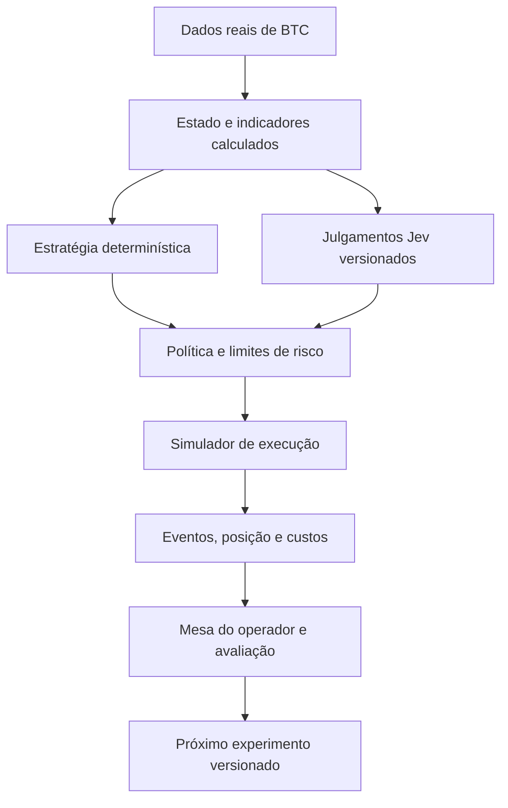

# Ganso Market 2.0 — decisão de produto e plano de integração

Data: 22/09/2026. Status: proposta de pesquisa, sem alteração de runtime, capital, configuração ou autorização de execução real.

Pedido: reavaliar a direção independentemente das regras atuais do projeto, combinar os componentes úteis do Ganso e dos projetos Jev e construir maturidade para operar. Esclarecimento do proprietário: começar com **US$ 1.000 fictícios**.

Base examinada: Ganso `d04875aa2845081f8cd24f98fb10acc816fcb7c5`, com alterações locais preexistentes preservadas; Jarrod `b587759e459ea049590102e54a0b07800864cdc3`; Ken Huang `d4b289586b6b21e07bf17f195acf06de920bb2a6`; Buberlo `15d089e656d968fabb750bde8ebeec6d0da1ac7d`; Aowang `a3f2f834a1b97dd42fab1193814179ac2e96d7cd`. Leitura estática e pesquisa em fontes primárias. Não foram executados backtests, chamadas pagas ao Jev, testes de integração de corretora ou operações.

## Decisão recomendada

Construir uma mesa pessoal com um núcleo pequeno de execução, risco e contabilidade, inicialmente para **BTC na Hyperliquid, contrato perpétuo padrão, com dados públicos de produção e execução inteiramente simulada**. Usar margem isolada simulada, configuração de 1x e limite inicial de nocional de 25% do patrimônio. A Polymarket permanece como integração especializada reaproveitável, fora do primeiro experimento econômico do 2.0.

A escolha de perpétuo é específica deste laboratório: permite testar posições compradas, vendidas e neutras no mesmo instrumento, aproveitar um conector TypeScript já usado pelo ecossistema Jev e representar custos públicos. Acrescenta funding, margem e liquidação ao simulador. **1x não transforma um perpétuo em spot nem elimina liquidação**, particularmente em posições vendidas. Esses eventos precisam ser contabilizados. A [documentação de margem](https://hyperliquid.gitbook.io/hyperliquid-docs/trading/margining) e a de [liquidação](https://hyperliquid.gitbook.io/hyperliquid-docs/trading/liquidations) definem essas diferenças.

BTC spot é a alternativa se a prioridade passar a ser remover integralmente margem e funding. Minha preferência atual pelo perpétuo é uma decisão de desenho do experimento, não uma conclusão de retorno superior. Uma futura escolha para dinheiro real também dependerá da elegibilidade do operador, do acesso e das condições efetivas de sua conta.

O primeiro objetivo econômico é testar uma estratégia simples de continuidade de tendência, com posição mantida por horas, e descobrir se um filtro Jev melhora seu resultado líquido. O objetivo operacional é completar todo o ciclo de ordem, execução parcial, saída, custo e reconciliação. Não existe meta obrigatória de número de operações ou retorno diário.

A simulação pode executar uma estratégia ainda sem evidência de alpha, identificada como experimental. Dados íntegros, contabilidade correta e limites continuam obrigatórios. Separar prontidão técnica de evidência econômica evita um simulador que exige prova de lucro antes de permitir coletar resultados. Ausência de evidência não deve virar uma falsa aprovação, nem impedir todo experimento com dinheiro fictício.

## Comparação das rotas

| Rota | Vantagem para o Ganso 2.0 | Trabalho e limitação | Papel recomendado |
|---|---|---|---|
| BTC spot | Um ativo contínuo; contabilidade mais simples; compra e retorno ao caixa | Taxas efetivas dependem da conta e da corretora; venda descoberta exige outro produto | Alternativa de menor complexidade financeira |
| BTC perpétuo padrão na Hyperliquid | Long/short no mesmo instrumento; conector TS disponível; taxas e funding documentados | Simular margem, mark price, funding e liquidação; revisar integrações | Primeiro laboratório simulado |
| Polymarket BTC de curta duração | Reaproveita coleta e modelos do Ganso | Payoff binário, vencimento, oráculo, fila e custos específicos | Preservar como extensão, sem competir pelo primeiro ciclo |
| Polymarket de eventos | Jev pode ajudar a interpretar regras e evidência textual | Seleção de universo, fontes, rotulagem lenta e resolução | Segunda tese possível, separadamente validada |
| Market making subsegundo | Muitos eventos para observar microestrutura | Seleção adversa, posição de fila, cancelamentos, custos e infraestrutura | Adiar até haver evidência de execução competitiva |

Essa tabela expressa julgamento de engenharia e pesquisa. Não é um ranking de rentabilidade demonstrada. Um preço contínuo simplifica vários contratos do sistema, mas não torna a previsão de BTC fácil.

## O que aproveitar dos projetos

| Origem | Incorporar ao desenho | Adaptar ou deixar de fora |
|---|---|---|
| Ganso | Registro de eventos, identificação de decisões, aritmética decimal, replay, limites, autenticação, painel e validação temporal | Separar tipos de Polymarket; não transportar equações de contratos binários para BTC |
| `jev-usecases` | Perguntas delimitadas, respostas tipadas, limiares explícitos, abstenção e análise semântica | Limiares publicados são iniciais; não representam confiança de lucro validada |
| Jarrod | Estado compacto e visualização do caminho decisão → ordem → fill | Acoplamento Kuru/Monad, cotação a cada bloco e ausência de uma escolha econômica de abstenção |
| Buberlo | Separação entre features, julgamentos, política, risco, execução e medição | O CLI observado usa dados sintéticos; a calibração exibida sobre a amostra ajustada não valida desempenho futuro |
| Aowang | Referência concreta de integração Hyperliquid, posição da corretora e saída reduce-only | Escolha de alavancagem pelo modelo, dependência de Bun, PnL em floats e qualquer hipótese de produção não verificada |

O [modelo de Aowang](https://github.com/aowang-ai/jev-trade/blob/a3f2f834a1b97dd42fab1193814179ac2e96d7cd/src/model.ts) inclui uma pergunta de alavancagem; o [trader](https://github.com/aowang-ai/jev-trade/blob/a3f2f834a1b97dd42fab1193814179ac2e96d7cd/src/trader.ts) aplica essa escolha ao abrir posições. Isso não deve entrar no Ganso: exposição e margem pertencem à política determinística. Seu [plano de ordens](https://github.com/aowang-ai/jev-trade/blob/a3f2f834a1b97dd42fab1193814179ac2e96d7cd/src/plan.ts) é útil como referência de entradas passivas e saídas que reduzem a posição.

O [CLI de Buberlo](https://github.com/buberlo/jev-trader/blob/15d089e656d968fabb750bde8ebeec6d0da1ac7d/src/jev_trader/cli.py) e a [política](https://github.com/buberlo/jev-trader/blob/15d089e656d968fabb750bde8ebeec6d0da1ac7d/src/jev_trader/policy/engine.py) sustentam a avaliação acima. O [catálogo de drillan](https://gist.github.com/drillan/6916b16e8ea31a8ec36c8f59d6483150) é um mapa para encontrar essas referências; não é validação independente das estratégias.

A integração deve ocorrer por componentes revisados, com versões fixadas e testes de contrato. Não há razão técnica identificada para reescrever o Ganso inteiro ou unir os históricos dos repositórios. Ao incorporar trechos substanciais, preservar avisos e atribuições das licenças correspondentes; a [licença de Aowang](https://github.com/aowang-ai/jev-trade/blob/a3f2f834a1b97dd42fab1193814179ac2e96d7cd/LICENSE) inclui a atribuição a Jarrod.

## Arquitetura proposta

Manter Node/TypeScript, Fastify, React e PostgreSQL. Um worker de mercado pode compartilhar bibliotecas com a API, mantendo o caminho de decisão separado de consultas pesadas e do painel. Não acrescentar um serviço Python apenas para importar Buberlo, nem ativar Rust por antecipação de uma necessidade de velocidade ainda não medida.

O [`@nktkas/hyperliquid`](https://github.com/nktkas/hyperliquid) é um SDK comunitário TypeScript compatível com Node. A documentação do próprio pacote informa que tipos podem mudar quando a API da venue muda; fixar a versão e validar contratos continua necessário. Usar o cliente oficial TypeSafe disponível na integração, atrás de uma interface pequena, sem acoplar a estratégia ao fornecedor.

Quatro contratos são suficientes no início: dados de mercado; julgamentos; intenção de operação; execução/contabilidade. Os identificadores precisam distinguir ambiente, conta simulada, instrumento, estratégia e versão. Não tentar padronizar antecipadamente todos os tipos de ordem de todas as corretoras.

| Código existente | Reaproveitamento concreto | Mudança necessária |
|---|---|---|
| `fundamental/fixed.ts` | Parsing e aritmética decimal | Separar utilitários de dinheiro das funções específicas de probabilidade; validar escalas do instrumento |
| `paper/ledger.ts` | Eventos idempotentes, replay e lógica de custo médio | Novo namespace/tabelas para BTC, eventos de funding e margem; não reinterpretar o histórico binário |
| `portfolio/state.ts` | NORMAL / REDUCE_ONLY / HALTED e rearme explícito | Recalcular risco com patrimônio, perdas abertas e custos do produto BTC |
| `paper/broker.ts` | Consumo de livro, preenchimentos parciais e tratamento de fila | Substituir taxa binária, atraso específico de Polymarket e penalidades fixas por parâmetros da venue |
| `fundamental/walkforward.ts` | Separação temporal, métricas e bootstrap | Métricas de retorno/risco para estratégias; Brier apenas onde houver previsão probabilística rotulada |
| `portfolio/ev.ts`, `sizing.ts`, `exits.ts` | Padrão de composição, limites e motivos | Novas fórmulas para preço contínuo, exposição e saída; não aplicar `q - preço` ou Kelly binário ao BTC |
| `Mesa.tsx`, `Decisoes.tsx` | Linguagem do operador e trilha de decisões | Controles de simulação, ciclo de ordens, custos e comparação de versões |

Os nomes nessa tabela referem-se a arquivos inspecionados em `apps/api/src/polymarket/` e `apps/web/src/`. A proposta não implica que funções possam ser movidas sem revisar imports, invariantes e testes.

## A tese econômica inicial

Hipótese: movimentos persistentes de BTC podem oferecer oportunidades de continuidade; entrada seletiva, exposição ajustada à volatilidade e giro limitado podem preservar parte desse movimento depois dos custos. A [pesquisa de Liu e Tsyvinski](https://www.nber.org/papers/w24877) documenta momentum em dados históricos de criptomoedas. Ela justifica investigar a família de estratégias; não valida parâmetros intradiários nem retorno em 2026.

Versão inicial proposta: sinais em barras fechadas de 15 minutos, contexto de uma hora e permanência máxima de seis horas. Um rompimento de faixa recente alinhado ao contexto gera um candidato long ou short; parâmetros exatos são poucos, publicados antes da avaliação e ajustados apenas no conjunto de treino. Não combinar simultaneamente grid, reversão à média, arbitragem e market making. Esses horizontes são escolhas de pesquisa, não resultados medidos.

A entrada considera spread, profundidade, volatilidade e custo de saída. Uma oferta passiva tem prazo e pode não executar. Um fallback agressivo só ocorre se o custo atualizado ainda couber na política; não perseguir automaticamente todo preço que escapou. Saídas seguem invalidação, limite temporal e risco, sem aguardar uma nova opinião do Jev.

No BTC, uma probabilidade direcional isolada não determina valor esperado: também importam o tamanho dos ganhos e perdas e a política de saída. A avaliação pode estimar `P(ganho) × ganho médio − P(perda) × perda média − custos`, com observações condicionadas ao setup e incerteza explícita. Antes de existir essa evidência, a política-base opera como hipótese experimental; não inventar uma probabilidade de lucro para satisfazer uma interface herdada de Polymarket.

O desequilíbrio de fluxo é uma feature candidata de execução. [Cont, Kukanov e Stoikov](https://arxiv.org/abs/1011.6402) observaram relação entre desequilíbrio e variação de preço em ações dos EUA; isso não comprova previsão negociável em BTC ou sobrevivência após custos. O uso local precisa de medição própria.

Mercados Polymarket podem retornar em um segundo ciclo com uma tese distinta: preço de contratos versus probabilidade calibrada ou inconsistência lógica entre eventos, apoiada por classificação de regras e fontes. A decisão de reativar essa frente deve usar dados de preenchimento, custos e retorno por capital/tempo bloqueado, sem comparar apenas taxa de acerto.

## Papel exato do Jev

Começar com um challenger: a mesma estratégia-base, mas com um filtro Jev sobre o estado calculado. As primeiras perguntas podem tratar de compatibilidade do cenário com continuidade de tendência e ambiguidade do setup. Comparar esse filtro com um filtro determinístico simples sobre as mesmas features. Se a IA não acrescentar valor, a estratégia deve continuar utilizável sem ela.

Dados velhos, limites de posição, funding devido, tamanho, stop, exposição e cálculo de lucro são determinísticos. Informações necessárias à decisão devem estar no estado; a chamada Jev não implica acesso autônomo a notícias ou pesquisa. A [documentação de limitações](https://docs.typesafe.ai/model-jaggedness/jev-1.13) recomenda manter cálculo e comparação de datas em código e alerta para instruções adversariais e informação irrelevante.

O [significado de confidence](https://docs.typesafe.ai/confidence) não é probabilidade de lucro. Separar distribuição das classes, confiança, magnitude esperada do movimento e custo. Várias perguntas ao mesmo modelo não são evidências estatisticamente independentes; não multiplicar suas probabilidades como se fossem.

Armazenar modelo retornado, versão das perguntas, estado completo, fontes, timestamps, latência, resposta bruta, decisão final e custos. Fixar uma versão do modelo quando disponível, em vez de avaliar uma estratégia cujo `latest` muda silenciosamente. O replay reutiliza a resposta registrada; chamar novamente uma API não reproduz necessariamente a decisão antiga.

Timeout ou resposta inválida bloqueia a nova entrada do challenger e mantém saídas e risco ativos. A política-base continua rodando em seu próprio experimento. Não substituir silenciosamente uma falha do Jev por uma heurística e publicar o resultado como se viesse do Jev.

Em uma etapa posterior, a aplicação semanticamente mais natural é verificar se uma publicação oficial contradiz a tese ou muda o contexto do mercado. Isso exige um feed de fontes timestampadas e uma avaliação própria. Não incluir essa infraestrutura no primeiro ciclo só para justificar o uso da IA.

## Custos que justificam reduzir o giro

Na consulta de 22/09/2026, a [tabela da Hyperliquid](https://hyperliquid.gitbook.io/hyperliquid-docs/trading/fees) apresenta, para perpétuos na faixa-base, 0,015% maker e 0,045% taker. Hipótese ilustrativa: abrir US$ 250 como maker e fechar os mesmos US$ 250 como taker custa US$ 0,15 em taxas. Vinte ciclos diários custariam US$ 3/dia ou US$ 90 em 30 dias, antes de spread, slippage, funding e IA. São contas de cenário, não estimativas da atividade futura. Ler condições efetivas por conta/instrumento e não pressupor descontos, rebates ou renda de incentivos.

O [funding](https://hyperliquid.gitbook.io/hyperliquid-docs/trading/funding) é pago entre lados em intervalos horários e pode ser recebido ou pago. Deve usar sinal, posição e taxa do intervalo corretos; não fixar um custo diário arbitrário no simulador.

Na [Polymarket](https://docs.polymarket.com/trading/fees), a fórmula publicada para crypto é `cotas × 0,07 × p × (1-p)`. Cem cotas a US$ 0,50 custam US$ 50 e geram US$ 1,75 de taxa em uma execução taker, equivalente a 3,5% desse prêmio. É uma única perna de um produto de payoff diferente: não comparar diretamente com retorno percentual de BTC. O exemplo mostra por que copiar scalping para o mercado binário sem recalcular custos pode falhar. Makers têm tratamento distinto, com risco de fila e seleção adversa.

O preço divulgado pela [TypeSafe no lançamento](https://typesafe.ai/blog/introducing-system-one-models-and-jev) é US$ 0,042 por milhão de tokens de entrada. Com **1.000 tokens totais faturados por chamada**, um mercado e execução contínua por 30 dias:

| Cadência hipotética | Chamadas/dia | Custo de IA em 30 dias |
|---|---:|---:|
| 300 ms | 288.000 | US$ 362,88 |
| 2 segundos | 43.200 | US$ 54,43 |
| 1 minuto | 1.440 | US$ 1,81 |

Valores proporcionais aos tokens reais, sem créditos, gateway ou outros encargos. Coletar dados continuamente, calcular features em código e chamar Jev apenas em candidatos ou mudanças relevantes reduz custo e dependência de latência. O intervalo de consulta da IA é independente da frequência de leitura dos dados e da supervisão de risco. Dinheiro fictício na carteira não torna a API gratuita; o orçamento de API é separado e nenhuma chamada paga foi feita nesta análise.

## Simulação de US$ 1.000

Uma carteira operacional fictícia começa com US$ 1.000, denominados em USDC no simulador, com conversão nominal explicitada. Qualquer comparação de patrimônio em USD deve declarar essa hipótese. Benchmarks normalizados para US$ 1.000 são cenários alternativos: seus patrimônios não são somados nem compartilham reservas.

Parâmetros iniciais propostos para observação, ainda sem otimização empírica:

| Controle | Valor inicial |
|---|---|
| Instrumento | BTC perpétuo padrão, uma posição líquida por experimento |
| Margem | Isolada simulada, configuração 1x |
| Nocional máximo | 25% do patrimônio atual; US$ 250 no início, incluindo exposição potencial das ordens |
| Risco planejado por entrada | 0,25% do patrimônio, US$ 2,50 inicialmente, incluindo reserva para custos |
| Suspensão diária de novas entradas | Perda de 1,5% sobre patrimônio do início do dia, incluindo marcação e funding |
| Pausa para revisão | Drawdown de 5% a partir do maior patrimônio observado |
| Alteração dos limites pelo Jev | Nenhuma |

O tamanho é o menor entre cap de nocional, orçamento de risco dividido pela distância de invalidação mais custos estimados, liquidez e margem disponível. Stop e limites são gatilhos, não garantias de perda máxima; execução pode ultrapassá-los. Ordens pendentes reservam risco e caixa antes da confirmação.

Usar livro, negócios e contexto de produção, com relógios de origem e recebimento. O simulador registra atrasos, rejeições, cancelamento em trânsito, fills parciais, concorrência com saída e restart. Toque em candle não é evidência de fill. L2 agregado não revela a posição real da nossa ordem na fila: publicar cenários de fila e latência e tratar a estimativa como incerta. Testnet serve para validar protocolos, não para provar a economia dos fills de produção.

Separar dois resultados no painel: resultado das operações após taxas e funding; resultado econômico após IA e infraestrutura atribuída. O preço efetivo já incorpora slippage: sua atribuição deve ser mostrada sem descontá-la duas vezes do mesmo lucro. Marcar posições a preços executáveis, mantendo mark/oracle separado para margem e liquidação.

## Aprendizado e avaliação

Rodar no máximo três comparações inicialmente: referência simples de exposição a BTC/caixa, estratégia-base sem Jev e a mesma estratégia com filtro Jev. Comparar patrimônio, drawdown, exposição, tempo investido e giro. Uma carteira em BTC durante um mercado de alta é um benchmark relevante; lucro absoluto sozinho não demonstra contribuição da estratégia ou da IA.

Registrar também os candidatos recusados. Avaliar operações evitadas e oportunidades perdidas, deixando claro que são resultados contrafactuais simulados. Comparar a política completa: filtrar entradas altera a trajetória de posições, reservas e saídas, de modo que comparar só os trades aceitos cria viés.

Métricas prioritárias: PnL líquido por dia/semana e por unidade de risco; drawdown; concentração em dias/episódios; giro; custo por ciclo; proporção de fills; diferença entre preço de decisão e execução; markout; dados faltantes; decisões vencidas; divergências de reconciliação; benefício incremental do Jev com seu custo e latência. Taxa de acerto é auxiliar.

Separar treino, calibração e avaliação no tempo. Registrar cada configuração tentada, inclusive as que falharam; manter um período futuro sem ajustes. A literatura sobre [backtest overfitting](https://academic.oup.com/jrssig/article/18/6/22/7038278) explica por que escolher a melhor configuração entre muitas pode produzir um resultado ilusório. Contar dias e episódios independentes; centenas de decisões sobre o mesmo movimento não são centenas de amostras independentes.

Para Jev, avaliação prospectiva é especialmente importante: não temos evidência sobre a ausência de informação histórica no treinamento do modelo. Fornecer uma notícia antiga e pedir uma previsão retroativa pode introduzir conhecimento do desfecho. Respostas coletadas antes do resultado e preservadas são a evidência principal.

O ciclo de maturidade é: hipótese registrada → versão congelada → observação → atribuição dos resultados → uma mudança justificada → nova comparação futura. Revisões semanais podem organizar o trabalho, mas não obrigam mudanças. Não perseguir cada perda com novos parâmetros nem promover automaticamente a versão de maior lucro recente. Maturidade aumenta a qualidade das decisões; não garante melhora monotônica do lucro.

## Experiência do operador

A mesa precisa responder: o sistema está saudável? Qual posição tenho? Quanto estou arriscando? Por que entrou ou recusou? Como sai? Quanto custou? A nova versão melhorou em quê?

Uma tela principal mostra patrimônio, PnL líquido, exposição, ordens, saúde de dados e estado de risco. Um ticket mostra direção, tamanho, preço limite, estimativa de custos, invalidação e prazo máximo. Na simulação, o operador pode criar ordem manual, aceitar candidato, pausar novas entradas, cancelar ordens e pedir encerramento; todas as rotas passam pelas mesmas reservas e limites. Assim a usabilidade transacional é verificável antes de dinheiro real.

Cada operação tem uma ficha: estado observado, hipótese, decisão-base, influência efetiva do Jev, motivo do limite aplicado, execuções e custos, saída e comparação com alternativas. Textos explicativos vêm desses registros. Não apresentar uma narrativa gerada posteriormente como se fosse o raciocínio interno que causou a ordem.

Exemplo de formato, sem dados reais: “Candidato comprado recusado: a tendência passou no filtro-base, mas o custo estimado excedeu o limite. Jev não foi consultado.” Ausência de operação por falta de vantagem é diferente de ausência causada por falha de dados; o painel precisa distinguir as duas.

## Sequência de entrega e critérios

| Entrega | Resultado concreto | Evidência de conclusão |
|---|---|---|
| 1. Contratos e feed BTC | Instrumento, timestamps, taxas, funding e livro verificáveis | Captura real com tratamento de gaps, reconexão e integridade; nenhuma posição inventada |
| 2. Conta simulada e ticket | Carteira US$ 1.000 e ciclo manual completo | Reserva, fill parcial, cancelamento, saída, funding e restart reconciliados; ledger reproduzível |
| 3. Estratégia-base | Uma política executável sem Jev | Configuração publicada, custos presentes e resultados futuros comparáveis à referência |
| 4. Challenger Jev | Mesmo sinal-base com filtro adicional | Respostas reais registradas; timeout visível; comparação futura incluindo custo e operações evitadas |
| 5. Mesa de avaliação | Atribuição de lucro/perda e comparação de versões | Cada ordem rastreável; resultados não dependem de soma de cenários alternativos nem de um único episódio |
| 6. Preparação de execução real | Adaptador de ordens e reconciliação da venue | Testes de protocolo, identificação de ordens, falhas de rede, permissões e parada; decisão de capital separada |

As entregas 1 e 2 medem capacidade de operar, sem exigir provar alpha. As entregas 3 a 5 medem qualidade econômica, sem confundir muitos fills com sucesso. Depois de um primeiro ciclo de aproximadamente 30 dias de observação, fazer um diagnóstico; esse prazo não é um limiar estatístico de aprovação. Se a amostra for pequena ou concentrada, a conclusão correta é inconclusiva.

Um futuro piloto real pode ter propósito estritamente operacional, com orçamento de perda previamente definido, mesmo antes de haver prova forte de rentabilidade. Aumento de capital exige evidência econômica diferente: resultado líquido prospectivo robusto a custos, risco compatível e contribuição identificada. A instrução atual autoriza planejar o caminho e começar com simulação, não executar esse piloto real agora.

Para execução futura, APIs de [ordens](https://hyperliquid.gitbook.io/hyperliquid-docs/for-developers/api/exchange-endpoint) e [eventos de conta](https://hyperliquid.gitbook.io/hyperliquid-docs/for-developers/api/websocket/subscriptions) oferecem identificação, atualizações e cancelamento programado. A integração deve respeitar limites e reconciliar confirmações ambíguas; cancelamento de ordens não encerra automaticamente posições.

## Decisão de investimento em desenvolvimento

Priorizar um ciclo completo de BTC simulado e observável. Reutilizar o núcleo financeiro e a interface do Ganso, adaptar o conector Hyperliquid do ecossistema e introduzir Jev como componente comparável e substituível. Preservar a especialização Polymarket para um segundo experimento. Suspender novas funcionalidades que não ajudem a executar, medir ou explicar esse primeiro ciclo.

O diferencial pretendido do Ganso 2.0 é permitir ao operador identificar exatamente de onde veio o resultado e decidir o próximo teste com evidência. A aposta econômica inicial é pequena e verificável; o sistema permanece útil mesmo se o primeiro modelo ou a primeira estratégia forem rejeitados.
