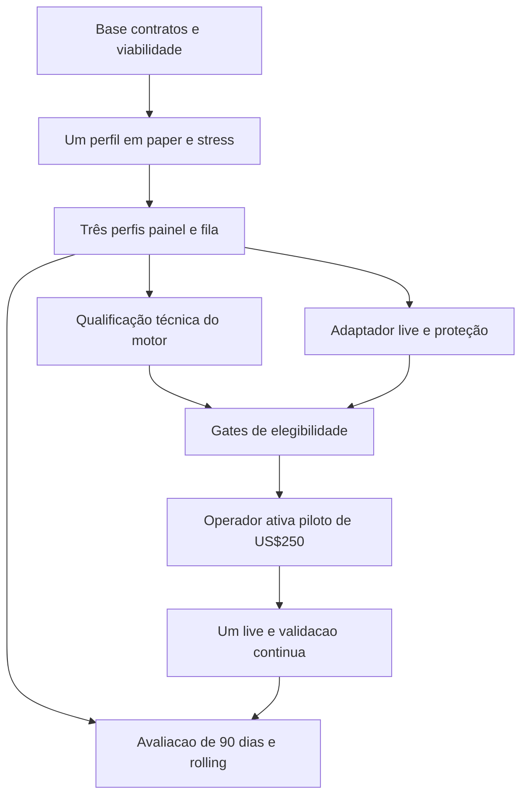

# Plano de implementação e implantação do Ganso Market com JEV

Planejamento de **07/10/2026**, baseado na [especificação confirmada](../PRD-GANSO-JEV.md) e na [comparação com a árvore local](../architecture/ganso-jev-code-map.md). O objetivo é entregar primeiro um ciclo BTC completo em paper/stress, depois três perfis com operação visual e geração controlada, e então um único piloto live de US$250.

**Estado desta revisão: somente documentação local.** Os 16 blocos GJ00–GJ15 abaixo continuam planejados. O [pacote de execução](../../prompts/jev/README.md) passa a usar **14 entregas agrupadas (JE01–JE14), 52 IDs rastreáveis e seis etapas operacionais separadas**. São 43 checkpoints de código e três diagnósticos nos grupos, além das seis etapas. Selecionar uma entrega tem [autorização para alteração, PR, merge e produção](../ops/DEVELOPMENT_AUTHORIZATION.md#ciclo-jev-com-autonomia-por-bloco) de todo seu escopo; preparar o formato não executa implementação, qualificação, compra, promoção ou ordens.

## Sequência e dependências

| Marco | Fatias | Resultado e condição de avanço |
| --- | --- | --- |
| Base e viabilidade | GJ00–GJ02 | Base reconciliada, contratos novos definidos e capacidade/orçamento admissíveis para iniciar o teste |
| Ciclo completo de um perfil | GJ03–GJ08 | JEV, risco, maker/IOC, paper/stress, worker, PnL e avaliação funcionam juntos |
| Três perfis e operação visual | GJ09–GJ11 | Três pares independentes, painel, fila curta e gerador controlado |
| Qualificação do motor | GJ12 | Sete dias operacionais e casos críticos comprovados, com cobertura e contabilidade válidas |
| Preparação live | GJ13–GJ14 | Adaptador, proteção nativa, reconciliação e promoção automática condicionada aos gates |
| Piloto e continuidade | GJ15 | Uma conta real, reservas em paper/stress, risco global e avaliações rolling em funcionamento |

A infraestrutura de custos/risco/execução vem antes da evidência econômica. Durante a observação técnica pode-se desenvolver o adaptador live em ambiente isolado; isso não habilita o piloto. A janela de 90 dias começa prospectivamente quando os experimentos forem admitidos e continua em paralelo ao piloto elegível.

## Execução em 14 entregas

O proprietário aprovou agrupar a execução em **07/10/2026**. Este formato substitui uma sessão/PR por ID e o alvo de 3–6 arquivos/uma migration. Os IDs originais preservam resultado, aceite, verificação e gates; tornam-se checkpoints internos. O tamanho segue a fronteira funcional e a capacidade de revisar/testar a integração. Dependências externas devem estar integradas ou comprovadas na base; dependências internas podem ser verificadas na mesma branch, sem PR intermediário.

| Entrega executável | Checkpoints | Depende de entregas |
| --- | --- | --- |
| [JE01 — Base reconciliada](../../prompts/jev/entregas/je-01-base-reconciliada.md) | GJ00.1, GJ00.2 | Nenhuma |
| [JE02 — Contratos e manifestos](../../prompts/jev/entregas/je-02-contratos-e-manifestos.md) | GJ01.1, GJ01.2, GJ01.3, GJ02.1, GJ02.2 | JE01 |
| [JE03 — Retenção e viabilidade](../../prompts/jev/entregas/je-03-retencao-e-viabilidade.md) | GJ02.3, GJ02.4 | JE02 |
| [JE04 — Decisão JEV integrada](../../prompts/jev/entregas/je-04-decisao-jev-integrada.md) | GJ03.1, GJ03.2, GJ03.3, GJ03.4 | JE02 |
| [JE05 — Risco e dimensionamento](../../prompts/jev/entregas/je-05-risco-e-dimensionamento.md) | GJ04.1, GJ04.2, GJ04.3 | JE02 |
| [JE06 — Execução e proteção](../../prompts/jev/entregas/je-06-execucao-e-protecao.md) | GJ05.1, GJ05.2, GJ05.3, GJ06.1 | JE05 |
| [JE07 — Worker e cadências](../../prompts/jev/entregas/je-07-worker-e-cadencias.md) | GJ06.2, GJ06.3 | JE04, JE06 |
| [JE08 — Contabilidade e referências](../../prompts/jev/entregas/je-08-contabilidade-e-referencias.md) | GJ07.1, GJ07.2, GJ07.3 | JE03, JE07 |
| [JE09 — Avaliação contínua](../../prompts/jev/entregas/je-09-avaliacao-continua.md) | GJ08.1, GJ08.2, GJ08.3 | JE08 |
| [JE10 — Perfis simultâneos](../../prompts/jev/entregas/je-10-perfis-simultaneos.md) | GJ09.1, GJ09.2, GJ09.3 | JE09 |
| [JE11 — Painel e prontidão](../../prompts/jev/entregas/je-11-painel-e-prontidao.md) | GJ10.1, GJ10.2, GJ10.3, GJ12.1 | JE10 |
| [JE12 — Gerador e fila](../../prompts/jev/entregas/je-12-gerador-e-fila.md) | GJ11.1, GJ11.2, GJ11.3, GJ11.4 | JE11 |
| [JE13 — Adaptador live e proteção nativa](../../prompts/jev/entregas/je-13-adaptador-live-e-protecao-nativa.md) | GJ13.1, GJ13.2, GJ13.3, GJ13.4 | JE10 |
| [JE14 — Promoção e sucessão](../../prompts/jev/entregas/je-14-promocao-e-sucessao.md) | GJ14.1, GJ14.2, GJ14.3 | JE12, JE13 |

Dependências do quadro são resumidas transitivamente; `depends_on` de cada checkpoint permanece obrigatório. Uma entrega selecionada executa todos os seus IDs sem novo pedido por parte. Faça testes específicos ao implementar, corrija falhas antes da parte dependente e consolide revisão, PR, validação completa, merge e implantação seletiva no fechamento. Checks obrigatórios de PR/main, PostgreSQL real e integração Compose permanecem; não repetir suíte completa entre checkpoints sem motivo. Prefira um PR coerente; divida somente por fronteira funcional/compatibilidade, mantendo o grupo aberto até todos os aceites.

Leia contratos/seções uma vez e código por símbolo conforme necessário. Registre somente a linha da entrega e seus IDs verificados no [estado JEV](GANSO_JEV_EXECUTION_STATE.md), que podem compartilhar PR/SHA. Se interrompido, mantenha o grupo aberto e registre base/branch, delta, falhas e próximo checkpoint. Sem recibo, pasta de evidência ou relatório extra. Respostas JEV, ledger, fills e métricas são dados do produto.

As etapas **GJ12.2, GJ12.3, GJ13.5 e GJ15.1–3** continuam selecionadas separadamente. Não pertencem ao escopo de código dos grupos. Admissão paper exige prontidão/capacidade/cobertura/custo efetivos; testnet exige conta dedicada existente; qualificação/elegibilidade/ativação autenticada condicionam live. Código desativado pode ser entregue antes desses gates. Sete dias, 60 episódios e 90 dias exigem evidência real.

Após JE02, JE03/JE04/JE05 têm dependências de código independentes. JE07 integra as frentes de JEV e execução. Após JE10, JE11 e JE13 podem avançar separadamente. Partes do gerador podem avançar após JE09, mas JE12 só fecha depois de JE11; respeitar os checkpoints. Se o proprietário solicitar trabalho paralelo, iniciar com até duas frentes coordenadas, arquivos/contratos com dono e migrations sem colisão; integração dos deltas continua serial. Não criar agentes/chats automaticamente.

Após JE11/JE12 e gates reais, selecionar GJ12.2 para iniciar a observação. Desenvolver JE13/JE14 desativados durante essa janela e selecionar GJ13.5 quando admissível. A avaliação completa de 90 dias não acrescenta espera obrigatória ao piloto inicial elegível. Medir duração/checks/retrabalho nas primeiras entregas antes de otimizar o executor PostgreSQL; esta revisão não altera CI nem promete ganho de tempo percentual.

## Base e viabilidade

### GJ00 Reconciliação da base e superfícies de implantação

**Dependência:** nenhuma. Conferir checkout, main remota, schema e versões dos serviços efetivos quando a implementação for solicitada. A inspeção inicial encontrou HEAD d04875a com muitos arquivos BTC não rastreados; esse SHA sozinho não representa a árvore analisada. GJ00.1 fixa a base Git em main 01d0e6d, onde BTC/contratos/migrations até 0050 já estão integrados; o [estado](GANSO_JEV_EXECUTION_STATE.md) registra publicação e verificações. Schema efetivo e versões dos serviços pertencem a GJ00.2. Preservar todas as alterações alheias, reconciliar diferenças já entregues e usar checkout isolado para código quando necessário.

Conferir contrato/manifesto/replay e referências locais ausentes, incluindo caminhos documentais de contratos. Usar os registros de setembro como histórico, não como medição atual. Não restaurar Polymarket nem repetir implementações já integradas.

**Aceite:** base de trabalho e versões identificadas; delta próprio delimitado; schema, contratos e configuração compatíveis; funcionalidades novas desativadas; acervo anterior íntegro. Entrega de inventário/base não precisa esperar qualificação econômica.

### GJ01 Contratos de contas perfis e capital

**Dependência:** GJ00. Estender contratos monetários, identidade e gênese para capital explícito de US$250, três pares paper/stress e vínculo do piloto com perfil/versionamento. Separar início da conta, início de experimento e recorte de avaliação. Definir singleton live e estado global sem instanciar execução real.

Pontos de partida: contratos trading, ledger/ledgerstore, risco/âncoras e migrations 0029–0038. Novos caminhos e migrations são entregas futuras; não editar versões aplicadas. Definir a identidade financeira duradoura do piloto e atribuir perfil/versão às decisões e operações de forma imutável. Trocar perfil não reescreve ownership de fills anteriores nem cria outra gênese fictícia de US$250: a conta real preserva patrimônio e histórico.

**Aceite:** replay antigo de US$1.000 mantém resultados; contas novas têm gênese correta; eventos não atravessam dono/versão/modo; nenhum capital fictício vira capital disponível no live; criação duplicada e concorrência não produzem duas contas live.

**Verificação:** fixtures monetárias independentes e PostgreSQL descartável para ownership, gênese, locks, idempotência e compatibilidade.

### GJ02 Manifestos contexto retenção e orçamento

**Dependência:** GJ01. Fixar esquema comum de contexto e perguntas dos três perfis iniciais, horizontes 1/3/5min, fórmulas/janelas, limiares ATR/proximidade do stop, cooldown, frescor/deadlines e faixas permitidas ao gerador. Fixar a âncora do stop diante de preenchimentos parciais antes de observar resultados. Risco e execução não são variáveis do gerador.

Projetar a evidência mínima necessária para replay de decisão, fila maker, fills, funding e cobertura; identificar quais dependências precisam permanecer e quais raw podem expirar. Dimensionar decisões de manter, uso de 2s, três pares e 180 dias de retenção após encerramento, incluindo falhas e propostas aposentadas. Retenção de 7d não remove dependências pinadas.

Os tetos SQL 10/12GiB e do coletor 4/6/4GiB são diferentes. Demonstrar armazenamento, CPU/RAM, conexões e escrita compatíveis sem pressupor aumento de quota, compra ou descarte protegido. Definir headroom e retorno seguro da coleta.

**Aceite:** manifestos completos/versionáveis e rastreáveis; espaço/orçamento admitidos para o ensaio delimitado; nenhum dado futuro/gap fabricado; preço/lote mínimos cabem no risco ou a ordem é bloqueada; política de expiração protege dependências.

**Gate em duas etapas:** antes de contratar/iniciar, estimar com corpus/fixtures e tarifa documentada; antes de operação admitida, confirmar capacidade e custo/latência efetivos no ambiente e credencial aplicáveis. Mock não comprova custo ou latência do provedor.

## Ciclo completo de um perfil

### GJ03 Decisões JEV lotes e custos reais

**Dependência:** GJ02. Reaproveitar transporte HTTP direto, credencial protegida, deadline, reserva, validação de usage/tarifa, resposta original e circuit breaker. Substituir filtro allow/veto/abstain pelo contrato de direção/intenção. Lote somente por perfil, com texto de cada pergunta explicitamente vinculado à conta.

Separar pools mensais agregados US$8 operacional/US$2 geração-validação, reserva concorrente e despesa real por request único. Falha de decisão pode ter cobrança. Erro de uma conta com binding confiável não deve invalidar resposta válida de outra; erro de transporte ou binding invalida o lote afetado.

**Aceite:** modelo fixado; nenhuma saída depende de JEV disponível; nenhuma resposta tardia ou sem dono origina ordem; não há retry automático oculto nem fallback real→mock; orçamento global não é multiplicado por perfil; replay não reinfere.

**Verificação:** ampliar suítes JEV para respostas parcialmente inválidas, lote ambíguo, timeout após envio, custo desconhecido, reserva concorrente, restart e faturamento único. Consumo pago exige cobertura/autorização aplicáveis; não é efeito da documentação.

### GJ04 Supervisor de risco e tamanho

**Dependência:** GJ01, GJ02. Adaptar risco/checkpoints para 1% por entrada, 50% exposição, diário 2%, stop 2ATR e DD fixo US$12,50. Projetar estado global do piloto atravessando perfis; regras são exercitadas primeiro em ambiente controlado.

Sizing inclui stop, taxas, funding e reserva integral da tolerância de 10% do stop market nativo. Quantidade deve ser válida e respeitar mínimo; bloquear quando não couber. O motor de risco não espera o modelo.

**Aceite:** fronteiras exatas antes/no/depois do limite; diário UTC não zera HWM global; valores persistem no restart e troca de perfil; crescimento não aumenta o orçamento de DD; bloqueios cancelam entradas e solicitam redução; custo JEV/infra não altera a base de negociação.

**Verificação:** casos calculados independentemente, incluindo US$250→270 e piso global US$257,50; concorrência entre funding, fill, rollover e checkpoint; sem alteração dos resultados do contrato antigo.

### GJ05 Execução maker e IOC integradas

**Dependência:** GJ04. Integrar primitives passive/broker/reservations sob a mesma conta e contrato de consumo de liquidez. Implementar cotação um incremento dentro do spread, fallback ao próprio melhor preço, post-only, latência 1s/2s e espera de 2s desde ACK.

Cancelar restante sem top-up; reconciliar fill durante cancelamento. Paper usa fila/trades observados e marca incerteza de prioridade. IOC de saída só reduz e mantém pendência se faltar liquidez.

**Aceite:** entrada maker e saída IOC coexistem sem double-fill, double-fee ou inventário oposto; cruzamento é rejeitado; nenhum fill antes da chegada ou só por tocar no preço; partial/cancel/restart preservam quantidade/custos; primeira parcial já aciona proteção.

**Verificação:** ampliar passive/broker/reservation suites com long/short, spread de um incremento, profundidade desconhecida, parciais múltiplas, cancel race, dados stale e reductions concorrentes. O antigo guard de cenários separados só sai com essa cobertura.

### GJ06 Proteções e worker de execução

**Dependência:** GJ03, GJ05. Extrair ATR/saídas da baseline para supervisor dos perfis, eliminar trend exit da política nova e usar mark-trigger no paper/stress. Prazo máximo de 6h começa no primeiro fill e não é renovado por parciais/restart.

Extrair execução da API para worker TypeScript dedicado, mantendo coletor separado. Cadência padrão 60s; fast 2s somente com posição+gatilho. Scheduler não acumula consultas obsoletas e registra atraso; risco, reconciliação e cancelamento têm prioridade sobre geração/entrada.

**Aceite:** fechar API não desliga o dono de execução; lease/fencing impede dois donos; resposta JEV nunca altera limites; falha de JEV não impede stop/diário/prazo; recuperação reconcilia antes de liberar entradas; feed sem prova de frescor não gera fill artificial.

**Verificação:** falhas entre reserve/send/ACK/fill/cancel/commit, perda de lease e restart, replay sem duplicação de comando/custo e simulação de mark cruzando stop com bid/ask divergentes.

### GJ07 PnL atribuição JEV e benchmarks

**Dependência:** GJ03, GJ06. Separar livro de despesa real, custo conservador de avaliação e registro manual de infraestrutura. Publicar PnL de negociação, resultado após JEV e fórmula de elegibilidade sem lucro aberto.

Aplicar custo integral do lote a cada conta participante na avaliação, mas contabilizar request uma vez na despesa global. Fixar antes do aceite econômico a regra de atribuição dos custos JEV de geração/validação, mantendo registros e incompletude explícitos. Não reutilizar CostAllocation atual como se rateios conservativos fossem cobranças.

Implementar caixa US$250 e BTC passivo de exposição 50%, quantidade fixa, execução/custos/funding e gatilho DD US$12,50, sem reentrada. Mesmos recortes/convenções identificadas, sem reset de benchmark a cada janela.

**Aceite:** fees/slippage não duplicados; custo desconhecido impede resultado completo; infraestrutura excluída mesmo sem fatura; lucro aberto não qualifica e perda aberta desconta; conjunto de contas alternativas não produz falso total financeiro.

**Verificação:** métricas sobre trajetórias independentes com parciais, funding tardio, chamada compartilhada cobrada uma vez, custo desconhecido, lucro/perda abertos e benchmark parado em caixa.

### GJ08 Avaliador prospectivo e estados

**Dependência:** GJ07. Contar episódios integralmente fechados; estabelecer denominador de cobertura independente da quantidade de chamadas. Implantar condições iniciais 60 episódios por conta, 99%, resultado conservador positivo e qualificação técnica. Construir avaliação completa de 90d/rolling diário com margem 5pp sobre o melhor benchmark.

Estados distintos: em validação, elegível ao piloto, inconclusiva e reprovada. Falha comprovada de risco tem precedência; insuficiência de amostra/custo/gap não vira reprovação econômica artificial. Prévia de 30d não reotimiza a versão.

**Aceite:** operação atravessa janela sem liquidação/reset artificial; 59 versus 60 episódios, cobertura abaixo/no limite, custos incompletos e referência ausente são corretamente tratados; paper ou stress reprovado reprova perfil; versão material nova não herda avaliação favorável.

**Verificação:** fixtures de trajetória e fronteiras de janela, não teste que apenas repete condições do código. Avaliador não habilita live nesta fatia.

## Três perfis e operação visual

### GJ09 Pares simultâneos e reservas

**Dependência:** GJ08. Generalizar consumer/identidades para três perfis e três stress prospectivos. Mesmo contexto/critério inicial, horizontes 1/3/5min; cada conta mantém sua posição, riscos, funding e respostas.

**Aceite:** todas as contas podem operar simultaneamente sem vazamento de inventário, capital, trades consumidos ou estado JEV; resposta paper não é imposta ao stress com estado diferente; orçamento e capacidade agregados permanecem válidos; reservas continuam sendo avaliadas depois da primeira elegibilidade.

**Verificação:** concorrência no banco e carga delimitada em horários de decisão coincidentes, com JEV atrasado/indisponível e uma conta em redução; coleta e proteção mantêm prioridade.

### GJ10 Painel do operador

**Dependência:** GJ09. Evoluir Mesa/Operações/Experimentos/Sistema para visão por perfil e conta, PnL claro, componentes, limites, proteção, decisões/latência e estados de qualificação. Separar custos JEV/infra e patrimônio real/fictício.

Publicar controles idempotentes de pausa/emergência e capacidades existentes; ativação live só aparece habilitada após GJ14 e gates aplicáveis. Não introduzir ticket manual ou alteração de perfil ativo no fluxo automático.

**Aceite:** operador reconhece o que está operando, em espera, sem proteção, stale ou bloqueado; valores incompletos não aparecem como zero/lucro confirmado; cartões e gráficos explicam os mesmos números; autorização de escrita atual é preservada.

**Verificação:** testes de estados do usuário e navegação/visualização com dados representativos, incluindo vazio, erro, long/short, parcial, bloqueio e custo desconhecido. Verificar bundle/versão e fronteira HTTP na publicação aplicável.

### GJ11 Gerador fila e sucessoras

**Dependência:** GJ10. Registrar propostas imutáveis e fingerprints; gerar por vaga/histórico encerrado/orçamento, alterando um componente dentro das faixas fixadas. Gate determinístico mais aprovação técnica JEV; sem aprovação econômica presumida.

Fila de até três esperando; operador remove/reordena e sua escolha persiste. Proposta removida/idêntica reprovada não volta por troca de identificador. Vaga só é liberada após cancelar/encerrar/reconciliar o perfil anterior.

**Aceite:** fila nunca estoura nem muda versão ativa; indisponibilidade/veto JEV impede auto-admissão; concorrência entre operador e gerador preserva prioridade/remoção; orçamento esgotado mantém espera; não há código arbitrário gerado.

**Verificação:** gates, fingerprints e disputas de fila com fixtures; validar custo/usage/restart por proposta e transições operacionais. Sem produção automática de variantes enquanto o motor não estiver admitido.

## Qualificação e preparação live

### GJ12 Qualificação técnica do motor

**Dependência:** GJ09; visibilidade GJ10. Reunir validação controlada dos caminhos de falha e iniciar acompanhamento de **sete dias operacionais contínuos** do motor admitido. Registrar cobertura real, atrasos, crescimento, conciliação e proteção; observar recuperação permitida sem lacuna financeira.

**Aceite:** capacidade/frescor válidos, erros reconciliados, riscos e reservas corretos, custo conhecido, nenhum gap financeiro irrecuperável. Uma falha material exige correção e janela válida; um perfil novo no mesmo motor não reinicia automaticamente a qualificação técnica.

Os sete dias são observação operacional, não duração obrigatória da sessão de código. Registrar observing e encerrar a entrega; acompanhar em tarefa autorizada posteriormente. Fixtures não contam como operações prospectivas das 60 exigidas.

### GJ13 Adaptador live e proteção nativa

**Dependência:** GJ01, GJ04–GJ07; pode ser desenvolvido isoladamente após GJ09. Criar contrato live e adaptador autenticado Hyperliquid, sem ativação automática. Revalidar APIs, metadados, taxas, mínimos, signing e estados atuais em documentação oficial.

Implementar ALO/IOC reduce-only, IDs, recibos, fills reais, custo/funding efetivo e reconciliação de posição/ordens/proteções. HTTP aceito não é prova de fill; estado incerto exige consultar antes de repetir. Instalar stop market por posição desde parcial, independente dos filhos da entrada.

**Aceite:** fronteiras de credencial/modo explícitas; encontrar chave não habilita trading; erro por ordem tratado; parcial protegido; proteção não confirmada bloqueia entrada/cancela restante/solicita IOC; cancelamento da entrada não remove a proteção necessária; restart reconcilia antes de abrir.

**Verificação:** contratos em mocks/fixtures de API, ambiente de teste da venue somente dentro da autorização aplicável, e reconciliação de recibos. Não declarar comportamento nativo aprovado apenas por uma simulação local. Ambiente de teste é identificado e não produz evidência de retorno real.

### GJ14 Ativação do piloto e sucessão

**Dependência:** GJ08, GJ10–GJ13. Disponibilizar ao operador ativação inicial explícita de US$250 e seus limites. Elegibilidade técnica/financeira validada no momento de ativar, singleton live e estado global persistente.

O primeiro elegível entra sem esperar os três. Só substituir por reprovação comprovada; cancelar/fechar/reconciliar antes de nova estratégia. Sucessora reutiliza patrimônio efetivo e HWM global; reordenar fila não destrava bloqueio global.

**Aceite:** insuficiência de amostra/custo ou falta de ativação impede entrada; duas promoções concorrentes resultam em um live; estratégia saudável não é trocada pelo melhor ranking; diário e DD global têm precedência; operador precisa decidir novamente após bloqueio global.

**Verificação:** sequência completa com eventos concorrentes/restart, posição ainda pendente e falha de proteção. Esta entrega prepara capacidade de ativação; a validação em dinheiro real pertence ao gate operacional específico.

### GJ15 Piloto observado e avaliação contínua

**Dependência:** GJ14, qualificação válida e ativação efetiva pelo operador. Operar apenas um perfil live no patrimônio admitido, mantendo três pares paper/stress, painel, fila e orçamento. Observar fills, custos, funding, proteção e diferença entre real/simulado, sem misturar suas evidências.

**Aceite:** posição e patrimônio reconciliados, HWM preservado, controles visíveis, nenhuma ampliação de capital/risco; fechamento e sucessão respeitam prioridades. Avaliação econômica completa fica observing até haver 90d/99%/60 operações/custos; ausência de resultado completo não é lucro aprovado.

Escalar capital, operar três estratégias reais, adicionar moedas ou automatizar custos de infraestrutura são evoluções futuras, sem aprovação operacional neste plano.

## Viabilidade do orçamento JEV

É preciso medir tokens e tempo por lote real, incluindo estados distintos de paper/stress/live. Lote não garante escolhas iguais às chamadas individuais nem economia suficiente.

Exemplo de planejamento para mês de 30 dias, **três perfis e um lote por perfil/ciclo**, supondo 1.000 tokens de entrada cobrados por lote e preço público de **US$0,042 por milhão** consultado em 07/10/2026:

| Cadência ilustrativa | Lotes no mês | Custo ilustrativo |
| --- | --- | --- |
| Sempre 60s | 129.600 | US$5,4432 |
| Sempre 2s | 3.888.000 | US$163,296 |

Esse exemplo não estima o payload real nem a tarifa da credencial. Mostra por que 2s depende de posição/gatilho e da admissão dentro do pool US$8; sem orçamento, novas entradas pausam e proteção continua. O pool de geração/validação é US$2 separado. A documentação publica cobrança por token de entrada e output gratuito para o modelo listado, mas tarifa, limites e consumo efetivos precisam de confirmação. [TypeSafe sobre modelos e preço](https://docs.typesafe.ai/models).

Infraestrutura fica fora do PnL e da aprovação das estratégias. Seu controle pelo operador permanece separado; isso não altera silenciosamente o teto de planejamento anterior.

## Implantação por componente

Implantar somente quando uma entrega de implementação for selecionada e estiver validada. A autorização JEV cobre alteração, PR, merge e publicação em produção cabíveis. A preparação do pacote permanece documental. Ativar trading, contratar consumo ou ampliar capital é diferente de publicar código.

| Componente | Implantação prevista | Verificação e reversão |
| --- | --- | --- |
| Documentação deste plano | Arquivos locais revisáveis; publicação textual quando fizer parte da entrega solicitada | Não recriar serviços por texto; preservar histórico e alterações preexistentes |
| Schema e contratos | Migration nova compatível antes dos leitores/escritores afetados | Testar em PostgreSQL descartável; checar versão aplicada; rollback de código não apaga/regrava eventos ou schema aplicado |
| Worker de execução | Imagem/entrypoint TS próprios, inicialmente sem admitir novas entradas | Conferir versão, lease/fencing e um dono; pausar entradas e reconciliar para voltar à versão compatível |
| API e frontend | Publicação seletiva de DTOs/controles e bundle, preservando auth/perímetro | Checar versões, leituras, escrita autenticada/idempotência e estados visuais; não confundir painel saudável com motor admitido |
| Coleta e retenção | Alterar somente o necessário às fatias de qualidade/capacidade | Conferir frescor, crescimento, pins e headroom; parar gravações não essenciais sem descartar protegido |
| Adaptador live | Publicar desabilitado até gates e ativação explícita | Conferir configuração/modo; no incidente bloquear novas entradas, manter proteção, cancelar/fechar/reconciliar antes da reversão |

Não fazer deploy indiscriminado para uniformizar SHAs de serviços compatíveis, remover volumes, editar migrations aplicadas ou desligar proteções de evidência. Backend antigo que não compreenda novos eventos não é rollback válido para essas contas. Registrar a versão compatível e o procedimento de quiescência em cada entrega.

## Verificação e acompanhamento

Cada checkpoint exige testes proporcionais às mudanças e aceite específico; revisão, checks completos e publicação são consolidados por entrega. SQL em banco descartável; não usar produção como suíte de testes. Uma checagem breve confirma o componente publicado; ensaio de sete dias e janela econômica são estados de acompanhamento separados.

Os testes existentes estão mapeados no [inventário](../architecture/ganso-jev-code-map.md#testes-existentes-para-reaproveitar). Antes da primeira implementação, levantar a baseline dos checks na base reconciliada. Não converter números históricos de testes de setembro em validação atual.

Quando uma entrega for iniciada, atualizar sua linha e somente os IDs cobertos no [estado JEV](GANSO_JEV_EXECUTION_STATE.md). Todos continuam **planned** após esta revisão. PR/SHA pode ser compartilhado; registrar apenas aceites e publicações observados. Código validado/publicado não equivale a operational-qualified/venue-verified/active. Etapas operacionais atualizam seus próprios IDs. Não alterar o roadmap antigo.

Primeira entrega: **[JE01 — Base reconciliada](../../prompts/jev/entregas/je-01-base-reconciliada.md)**, reunindo GJ00.1 e GJ00.2. Depois, selecionar a próxima entrega com dependências verificadas. Avançar entre checkpoints do grupo; outra entrega ou sequência exige seleção explícita. Esta atualização documental não inicia a execução do plano.
